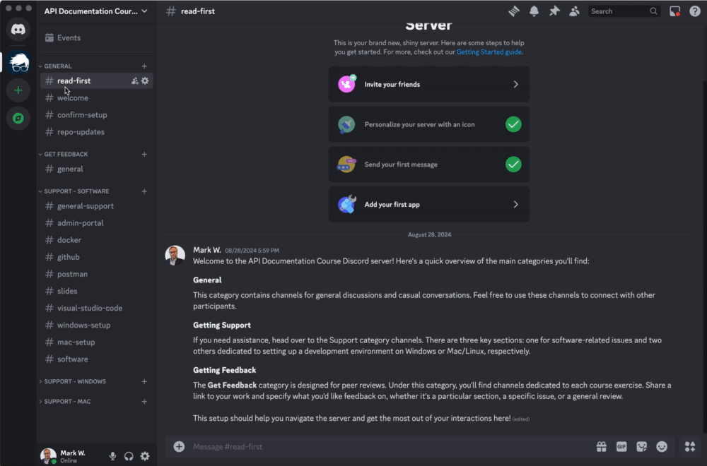

# API Documentation Course

Welcome to the API Documentation course! This repository contains everything you need to test and document the course API.

## About This Repository

This repository serves as a local API development environment, providing all the necessary components to develop, test, and debug an API on your machine. Here, you'll find everything you need to work with the course API—referred to as the POS API (Point-of-Sale API). The repository includes a frontend interface, an API server, and a MongoDB database, along with other essential tools.

As we progress through the course, you'll interact with various parts of this repository.

## Table of Contents

- [API Documentation Course](#api-documentation-course)
  - [About This Repository](#about-this-repository)
  - [Table of Contents](#table-of-contents)
  - [System Privileges and Course Setup](#system-privileges-and-course-setup)
  - [Required Software for the Course](#required-software-for-the-course)
  - [Join the Discord Server](#join-the-discord-server)
  - [Set up your Development Environment](#set-up-your-development-environment)
  - [Configuring Visual Studio Code](#configuring-visual-studio-code)
  - [Cloning the Repository](#cloning-the-repository)
  - [Project Directory Structure](#project-directory-structure)
  - [Creating Your Personal Directory](#creating-your-personal-directory)
  - [Running the Setup Script](#running-the-setup-script)
  - [Verifying Docker Containers](#verifying-docker-containers)
  - [Running Admin Panel](#running-admin-panel)
  - [Generating Diagrams](#generating-diagrams)
  - [Pulling Changes](#pulling-changes)
  - [Soliciting Reviews](#soliciting-reviews)
  - [Postman Setup](#postman-setup)
  - [Checklist](#checklist)
  - [Getting Help](#getting-help)

## System Privileges and Course Setup

To fully participate in the course, it's essential that you have administrative privileges on the machine you’re using. These privileges allow you to install software, run scripts, execute commands, and set up development environments. Many work computers, especially those not configured for developers, restrict these capabilities. Therefore, it’s highly recommended to use a personal computer for the course to ensure you can complete all tasks without restrictions.

If you only have access to a work computer while taking the course, send an email to [mark.wentowski@docsgeek.io](mailto:mark.wentowski@docsgeek.io) to discuss the available options.

**Note:** You only need a personal computer to complete the course exercises. A personal computer is not required during the training sessions where you'll only be viewing a presentation.

## Required Software for the Course

Search for these software applications on Google and download them:

- Discord
- Visual Studio Code
- Postman
- Google Chrome
- Docker Desktop

When prompted, create an account for each software.

If you are having trouble installing software, post to the channel dedicated to the software. For example, for Visual Studio Code issues, post to the **Support - Software** > [# visual-studio-code](https://discord.com/channels/1278288408795549716/1278305356530843698) channel.

## Join the Discord Server

1. Open the **Discord** app and sign in if needed.
2. Click the plus (**+**) icon on the left-side toolbar to add a server.
3. Select "Join a Server" under "Have an invite already?".
4. Paste the following URL into the "Invite Link" field:

   ```
   https://discord.gg/YucnPrkMMP
   ```

See the video below for reference:



You’ll be added to the course Discord channel where you can get support and ask questions as you set up your environment.

Head to the [#welcome](https://discord.com/channels/1278288408795549716/1278583957600079924) channel and introduce yourself!

If you encounter any issues, please email [mark.wentowski@docsgeek.io](mailto:mark.wentowski@docsgeek.io).

## Set up your Development Environment

Follow the instructions for your operating system:

- [Windows Setup](./docs/windows-setup.md)
- [Mac Setup](./docs/mac-setup.md)

Return to this README after completing those instructions.

If you encounter any issues, post your issue to the channel most closely related to your issue.

For example:

- **Windows:** If you are Windows are are having trouble installing Git Bash, post to the **SUPPORT - WINDOWS** > [# git-gitbash](https://discord.com/channels/1278288408795549716/1278295713742061579) channel.
- **Mac:** If you on Mac and cannot install Xcode, post to the **Support - Mac** > [# xcode](https://discord.com/channels/1278288408795549716/1278301960247971982) channel.

Remember to follow the issue template in the [Getting Help](#getting-help) section of this README.

## Configuring Visual Studio Code

1. Open Visual Studio Code.
2. Click the **Extensions** tab (refer to the left sidebar / broken cube icon) and search for the following extensions, then install them:

- Prettier (code formatter)
- ESLint (linter for JavaScript)
- Git Graph (visualize your Git commit history)

## Cloning the Repository

**Prerequisite:** Ensure you've set up SSH per the instructions in the [Windows](./docs/windows-setup.md) or [Mac](./docs/mac-setup.md) setup documentation. If you've already completed those steps, you can continue. Otherwise, please follow the setup instructions in the respective guide before moving forward.

From this GitHub repository:

1. Select the SSH option and copy the repository URL.
2. Open Visual Studio Code (if not already open).
3. Open a terminal. Do this by clicking **Terminal** at the top and selecting **New Terminal**.
4. Clone the repository by typing the following command, replacing the URL with the one you copied:

```shell
git clone git@github.com:gh-username/api-documentation-course.git
```

5. With a terminal open, change directories to the repo by running:

```shell
cd api-documentation-course
```

If cloning failed, check the terminal for error messages. If it mentions access rights, ensure you properly set up SSH by revisiting the setup documentation for Windows or Mac. If you are struggling to resolve the issue, you can post to one of the following support channels depending on your OS:

- **Support - Windows** > [# git-gitbash](https://discord.com/channels/1278288408795549716/1278295713742061579)
- **Support - Mac / Linux** > [# git](https://discord.com/channels/1278288408795549716/1278303208455798866)

If there were no issues, continue to the next section.

## Project Directory Structure

Take a moment to review the high-level folders/files of project and their purpose:

```sh
api-documentation-course/
┣ .vscode/                    # Contains VS Code configurations and settings
┣ admin/                      # React-based admin portal (frontend UI for the API)
┣ docs/                       # Documentation specific to setting up the repository
┣ openapi/                    # Source OpenAPI specifications and design artifacts
┣ postman/                    # Postman collection and environment files for API testing
┣ research/                   # Research artifacts and diagrams
┣ scripts/                    # Scripts used for setup automation and other tasks
┣ server/                     # API implementation (backend server)
┣ .gitignore                  # Specifies files and directories to ignore in Git
┣ .prettierrc                 # Configuration file for Prettier code formatting
┣ README.md                   # Main setup instructions and links to specialized docs
┣ docker-compose.admin.yml    # Docker Compose file for repository owner
┣ docker-compose.yml          # Docker Compose file for the main project setup
┣ package-lock.json           # Automatically generated file containing the exact version of dependencies
┣ package.json                # Lists project dependencies, scripts, and metadata
┗ setup.sh                    # Script to automate repository setup and initial configuration
```

You might not fully understand every folder or file right now, but it's helpful to develop a basic familiarity for when instructions direct you to use specific tools in this repository.

## Creating Your Personal Directory

You shouldn't edit the files in this project, except for those in the `personal` directory. Create this directory off the root to store any files you'd like to keep untracked by Git.

## Running the Setup Script

The `setup.sh` script automates the setup of this repository by handling tasks like installing project dependencies, starting Docker, and seeding the database so the API has data ready for use.

**Prerequisites:**

- Ensure Docker Desktop is open, as the script contains Docker commands.

1. Open a terminal (For Windows, a Git Bash terminal) in VS Code.
1. Make the script executable and run it:

```shell
./setup.sh
```

If you receive any popups asking for granting permissin for some program to make edits to your machine during the set up process, go ahead and grant permission and the script will continue running.

If the script fails or you encounter any error messages in the terminal, please copy the entire output and post it in the appropriate **Discord** channel based on your operating system:

- [# windows-setup](https://discord.com/channels/1278288408795549716/1278591699186090028)
- [# mac-setup](https://discord.com/channels/1278288408795549716/1278591744459669535)

Optionally, read and report on the messages that were outputted to the terminal and note the ones where issues arose.

## Verifying Docker Containers

After running `setup.sh`, open Docker Desktop (if not already open) and navigate to the **Containers** tab. You should see a high-level container named `api-documentation-course`. Expand it to view the sub-containers.

- Ensure each sub-container shows "Running" status.
- Check that each port in the Port(s) column is a clickable URL. If any port isn't clickable or any container isn't running, reach out on Discord for help.

If either two of the approve conditions are not met, please post your issue (using the template) to the [# docker](https://discord.com/channels/1278288408795549716/1278304522522988649) Discord channel.

If all containers are running and the ports are clickable, you're good to go!

## Running Admin Panel

The Admin panel is a frontend CRUD (Create-Read-Update-Delete) application that uses the ocurse API on the backend to retrieve and manipulate data.

1. Open a _new_ terminal in VS Code (use Git Bash if you're on Windows).

2. Run the following script:

```shell
./scripts/run-admin.sh
```

3. If the script runs successfully, a link to the Admin panel will be displayed. Click the link or visit [http://localhost:5173/](http://localhost:5173/) to view the admin panel in your browser.

When you're finished viewing the admin panel, stop the server by pressing `Ctrl + C` in the same terminal where you ran the script.

Here's a revised version with improved clarity and detail:

## Generating Diagrams

The `research` folder contains source files for your documentation, including Mermaid diagram files (`.mmd`). These files can be converted into `.png` images for easy insertion into your documentation.

1. Open a new terminal in VS Code. If you're on Windows, use Git Bash for compatibility.

2. Run the following command to execute the diagram generation script:

   ```shell
   ./scripts/generate-diagrams.sh
   ```

3. Upon successful execution, the script will convert each `.mmd` file into a `.png` file, ready for use in your documentation.

## Pulling Changes

Occasionally, updates may be made to the repository, and you'll need to sync these changes with your local version. The instructor will notify you in the [# repo-updates](https://discord.com/channels/1278288408795549716/1278608354469609525) Discord channel with specific instructions on how to pull the latest changes.

**Tip:** Keep an eye on the #repo-updates channel for announcements!

## Soliciting Reviews

The Discord server also includes a Get Feedback category where you can request feedback on your work. Each course exercise has its own channel under this category. Post a link to your work for others to review.

## Postman Setup

For detailed instructions on configuring Postman for this course, please refer to the [Postman Setup Guide](./docs/postman-setup.md).

## Checklist

To confirm that you’ve successfully set up everything, please post the following checklist items in [this channel](https://discord.com/channels/1278288408795549716/1278615668220100641) (add an `x` to each checkbox):

```markdown
- [x] Joined the Discord server
- [x] Downloaded software
- [x] Set up your development environment
- [x] Configured Visual Studio Code
- [x] Cloned the course repository
- [x] Successfully ran the set up script
- [x] Verified Docker containers are working
- [x] Ran and viewed the Admin
- [x] Set up and configured Postman
```

Once you’ve completed all items on the checklist, you’ll be ready for the next steps. Wait for further instructions from your instructor.

## Getting Help

For any questions or issues, visit the course Discord server. Different channels are available for various topics.

Post your inquiry in the channel that best matches your issue. Note there are three key sections: one for software-related issues and two others dedicated to setting up a development environment on Windows or Mac, respectively.

As you follow the README instructions, you'll be guided on which support topic to post in if you run into any issues.

When posting an issue, please use the following template:

```markdown
**Issue Title:**
Provide a concise title for your issue.

**Operating System**:
Specify your operating system (Windows/Mac/Linux). If you are posting to an OS-specific channel, then you can omit this information.

**OS Version:**
Indicate the specific release or version of your operating system.

**Type of computer:**
Is this a personal or work computer?

**Description:**
Give a detailed description of the issue. Include steps to replicate the problem, any error messages (you can copy from the terminal), and relevant screenshots if possible.
```
