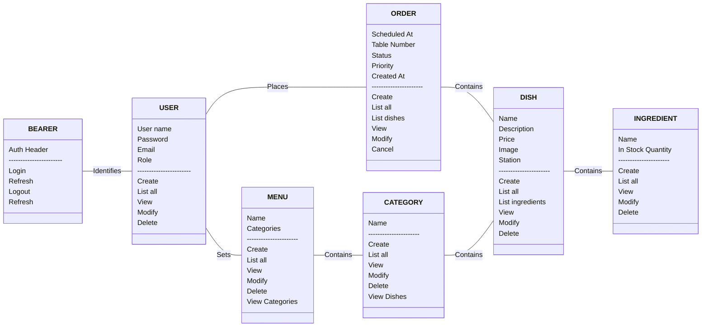

# Domain models

```mermaid
classDiagram
    direction LR
    class BEARER {
        Auth Header
        -----------------------
        Login
        Refresh
        Logout
        Refresh
    }

    class USER {
        User name
        Password
        Email
        Role
        -----------------------
        Create
        List all
        View
        Modify
        Delete
    }

    class ORDER {
        Scheduled At
        Table Number
        Status
        Priority
        Created At
        ----------------------
        Create
        List all
        List dishes
        View
        Modify
        Cancel
    }

    class DISH {
        Name
        Description
        Price
        Image
        Station
        ----------------------
        Create
        List all
        List ingredients
        View
        Modify
        Delete
    }

    class INGREDIENT {
        Name
        In Stock Quantity
        ----------------------
        Create
        List all
        View
        Modify
        Delete
    }

    class MENU {
        Name
        Categories
        ----------------------
        Create
        List all
        View
        Modify
        Delete
        View Categories
    }

    class CATEGORY {
        Name
        ----------------------
        Create
        List all
        View
        Modify
        Delete
        View Dishes
    }

    BEARER -- USER : Identifies
    USER -- ORDER : Places
    USER -- MENU: Sets
    ORDER -- DISH : Contains
    DISH -- INGREDIENT : Contains
    MENU -- CATEGORY : Contains
    CATEGORY -- DISH : Contains
```

## Resources

- [Mermaid class diagrams](https://mermaid.js.org/syntax/classDiagram.html)
