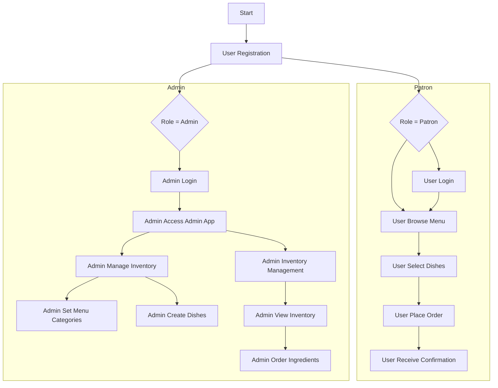

```mermaid
graph TD;
    A[Start] --> B[User Registration];
    B --> C{Role = Patron};
    B --> D{Role = Admin};

    subgraph Patron
        C --> E[User Login];
        C --> F[User Browse Menu];
        E --> F[User Browse Menu];
        F --> G[User Select Dishes];
        G --> H[User Place Order];
        H --> I[User Receive Confirmation];
    end

    subgraph Admin
        D --> J[Admin Login];
        J --> K[Admin Access Admin App];
        K --> L[Admin Manage Inventory];
        L --> M[Admin Set Menu Categories];
        L --> N[Admin Create Dishes];
        K --> O[Admin Inventory Management];
        O --> P[Admin View Inventory];
        P --> Q[Admin Order Ingredients];
    end

```