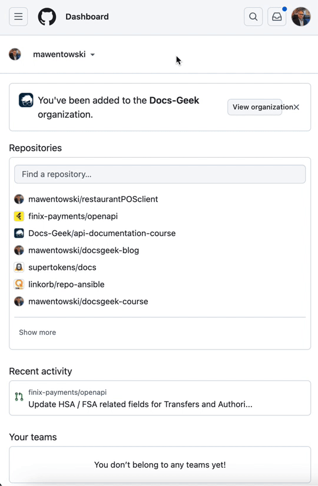

# Mac Setup Instructions

This guide will help you set up a development environment on a Mac.

## Table of Contents

- [Mac Setup Instructions](#mac-setup-instructions)
  - [Table of Contents](#table-of-contents)
  - [1. Download Xcode](#1-download-xcode)
  - [2. Install Xcode Command Line Tools](#2-install-xcode-command-line-tools)
  - [3. Generate an SSH Key for GitHub](#3-generate-an-ssh-key-for-github)
  - [4. Add SSH Key to GitHub](#4-add-ssh-key-to-github)
  - [5. Add SSH Key to Your GitHub Account](#5-add-ssh-key-to-your-github-account)
  - [6. Configure SSH Agent in `.zshrc`](#6-configure-ssh-agent-in-zshrc)
  - [6. Install Node.js and npm](#6-install-nodejs-and-npm)
  - [Next Steps](#next-steps)

## 1. Download Xcode

From the **App Store**, search for and download "Xcode". You'll need to be signed in to an iCloud account to download Xcode.

When you encounter the following screen, click "Install" (i.e., you're accepting the default components):


After the Xcode application opens, close the Xcode application.

If you are having an issue installing Xcode, post a question to the **SUPPORT - SOFTWARE** > [# xcode-tools](https://discord.com/channels/1278288408795549716/1278301960247971982) channel.

## 2. Install Xcode Command Line Tools

1. **Open Visual Studio Code**

   - Open the **Visual Studio Code** application you downloaded previously. Download it from Google if you have not done so.

     - Open **Finder**.
     - Navigate to the **Applications** folder.
     - Locate **Visual Studio Code** and double-click to open it.

   - From the Mac **Menu Bar** at the top of the screen, open a new terminal window in VS Code by clicking **Terminal** > **New Terminal**

2. **Install Xcode Command Line Tools:**

   - In the terminal you just opened, enter the following command:

     ```shell
     xcode-select --install
     ```

     For example (your terminal will look slightly different):

     

   - Hit ENTER to run the command.
   - Follow the prompts to complete the installation.

3. **Verify Installation:**

   - In your open terminal, type the following commands and hit ENTER:

     ```shell
     xcode-select --version
     xcodebuild -version
     gcc --version
     ```

   - If Xcode Command Line Tools are properly installed, you should see output _similar_ to the following:

     ```shell
       xcode-select version 2397.
       Xcode 14.3.1
       Build version 14E300c
       Configured with: --prefix=/Applications/Xcode.app/Contents/Developer/usr
     ```

   If you don't see output like this or encounter an error, post a question to the **SUPPORT - MAC** > [# xcode](https://discord.com/channels/1278288408795549716/1278301960247971982) channel.

## 3. Generate an SSH Key for GitHub

1. **Generate a New SSH Key:**

   - In your open terminal, type the following:

     ```shell
     ssh-keygen -t rsa -b 4096 -C
     ```

     Don't hit ENTER yet!

   - After the `-C`, you need to add a space, then write your GitHub email in quotation marks (i.e., the personal email you entered when setting up your GitHub account).

     The command so far looks like:

     ```shell
     ssh-keygen -t rsa -b 4096 -C "your_email@example.com"
     ```

   - After your email in quotation marks, you need to add a space, followed by the following characters: `-f ~/.ssh/id_GitHub_rsa`.
   - The command in the terminal should now look like the following (except the email address should be your email):

     ```shell
     ssh-keygen -t rsa -b 4096 -C "your_email@example.com" -f ~/.ssh/id_GitHub_rsa
     ```

     Ensure the command above matches what is inside your terminal (except for the email). If it is not, hit `Ctrl + C` to cancel then start Step #2 over again.

   - If the command is properly formatted, press `Enter` to accept the default file location.

   - When prompted for a passphrase, press `Enter` again to skip adding a passphrase.
   - Keep hitting `Enter` until you are returned to the command prompt. For example, when you have completed the process, you are returned to the command prompt:

     ```shell
     john@Johns-MacBook-Pro ~ %
     ```

     Your command prompt may appear slightly different. For instance, "John" will be replaced by your actual Mac username.

## 4. Add SSH Key to GitHub

1. **Copy SSH Key to Clipboard:**

   - In your open terminal in Visual Studio Code, display the contents of your public SSH key with:

     ```shell
     cat ~/.ssh/id_GitHub_rsa.pub
     ```

   - If a long string starting with `ssh-rsa` appears, the command worked.
   - Copy this string starting at `ssh-rsa`. For example, the string looks similar to the following (don't copy this one!):

   ```shell
   ssh-rsa AAAAB3NzaC1yc2EAAAADAQABAAACAQDJff1ovkl31I/G9WEPCZgPEI0YSkM9ZDFge/pVWgO4Dimt2R4AFB/wKrKjXhqBH1kuGCvY3E7RhKDHnovTslRQO5lyLhadgY7NIramRjjUItJxk39Bmdeuqgj+J/dRnths2JbZ/Fg1HdfGDEV2c7+ktank4ERhwnBfC1AykSMMYeU0B8fQg33IaQ7NHXDYPlw8/9uoYqJMtkTDEQyNlBsMt0ttragTk9XUpYj7X1dE+khQK2FiGcUNbTcCqR2YLFUtGtyHkzn6vmau3BO6cyphPUYdVFu3TEsBi02dWEBuskQwklT947Z8eQ9ZH05hIZxrVES6wc5q90AdBm856eSIviiwRg9BR4EXkm62eJgc6/gnAVEeb+8h/9O7dNDhnOJef2wwyO5qOVhY2xstFB//PFZddThAf95lbarZsFIeKuAl4Kba/KOoi1MgtskxmoadHIDapFP8U61ESZdseSinyr5TFs+k593tk+Z0dnzjzBx4PelTHxT6P/YZ6yUi5dFS5lkxH5YGUy1JAhN41l/IzQoHlcgT0oncIv49t1CpzFRL8hlu/d3VhObL3B5BVBJ0UaQffa0dWUUnpWzxcyFcE2+rkAvsdZ3htcwUIEgfUq0Gz4OjEMfv4YbQoIuq5DN7iJcyZfDYHQayzK6Lx5bP+M4tZ1vOVhqLUWqets5rUw== john@gmail.com
   ```

   Be careful _not to copy the command prompt_ that appears after the string. For example, the following command prompt appears after the previous string—- avoid copying that (your command prompt will look different):

   ```shell
   john@Johns-MacBook-Pro ~ %
   ```

## 5. Add SSH Key to Your GitHub Account

**Prerequisite**: You copied the public SSH key as instructed in the previous steps.

1. **Log In to GitHub:**

   - Go to [GitHub](https://github.com) and log in.

2. **Navigate to SSH Keys:**

   - Click your profile avatar.
   - Select **Settings**. Refer to the following video:

   

   - Go to **SSH and GPG keys**.
   - Click the green **New SSH key** button.

3. **Add Your SSH Key:**

   - Paste your public SSH key (the contents of `id_GitHub_rsa.pub`) into the key field and give it a descriptive title like "GitHub Public Key"
   - Click **Add SSH key** to save it.

   If you are having trouble adding your SSH key to GitHub, you can post to the **SUPPORT - Software** > [# github](https://discord.com/channels/1278288408795549716/1278293898204286987) channel for help.

## 6. Configure SSH Agent in `.zshrc`

1. Check if a `.zshrc` file exists.

   - In your open terminal in Visual Studio Code, run the following command to check if the `.zshrc` file is present:

     ```shell
     ls -la ~/.zshrc
     ```

   - If the file does not exist, create one by running:

     ```shell
     touch ~/.zshrc
     ```

1. **Open Your `.zshrc`:**

   - In the terminal, run:

     ```shell
     nano ~/.zshrc
     ```

1. **Add SSH Agent Configuration:**

   - Add these lines to the file:

     ```shell
     eval "$(ssh-agent -s)"
     ssh-add ~/.ssh/id_GitHub_rsa
     ```

   - Press `Ctrl + O` to save, press ENTER, then `Ctrl + X` to exit `nano`.

1. **Verify SSH Agent:**

   - In your open terminal, type the following command and hit Enter:

     ```shell
     source ~/.bash_profile
     ```

   - Run the following command to check if the SSH agent is running and if your SSH key is added:

     ```shell
     ssh-add -l
     ```

   - If successful, you should see a list of your added SSH keys.

   - If no keys are listed or you receive an error, there is likely an issue with configuring the SSH agent. You can post a question to **SUPPORT - Software** > [# ssh](https://discord.com/channels/1278288408795549716/1278302114812133418) channel for help.

## 6. Install Node.js and npm

1. **Download Node.js Installer:**

   - Visit the [Node.js website](https://nodejs.org/) and download the Node.js (LTS) installer.

2. **Run the Installer:**

   - Open the downloaded file to start the installation process.

3. **Follow the Installation Wizard:**

   - Click "Next" to proceed with the default options.
   - Choose the default installation location or select a different one if needed.
   - Ensure that the option to install npm (Node Package Manager) is selected.
   - Click “Install” and then “Finish” once the installation is complete.

4. Restart your computer.

5. **Verify Installation:**

   - Open a new terminal:
     - From the Mac **Menu Bar** at the top of the screen, open a new terminal window in VS Code by clicking **Terminal** > **New Terminal**
   - Check Node.js version:

     ```bash
     node --version
     ```

   - Check npm version:

     ```bash
     npm --version
     ```

   - Both commands should output their respective versions, confirming that Node.js and npm are properly installed.

## Next Steps

Aftering completing the steps in this document, go to the [README - Cloning the Repository](https://github.com/mawentowski/api-documentation-course?tab=readme-ov-file#cloning-the-repository) section.
