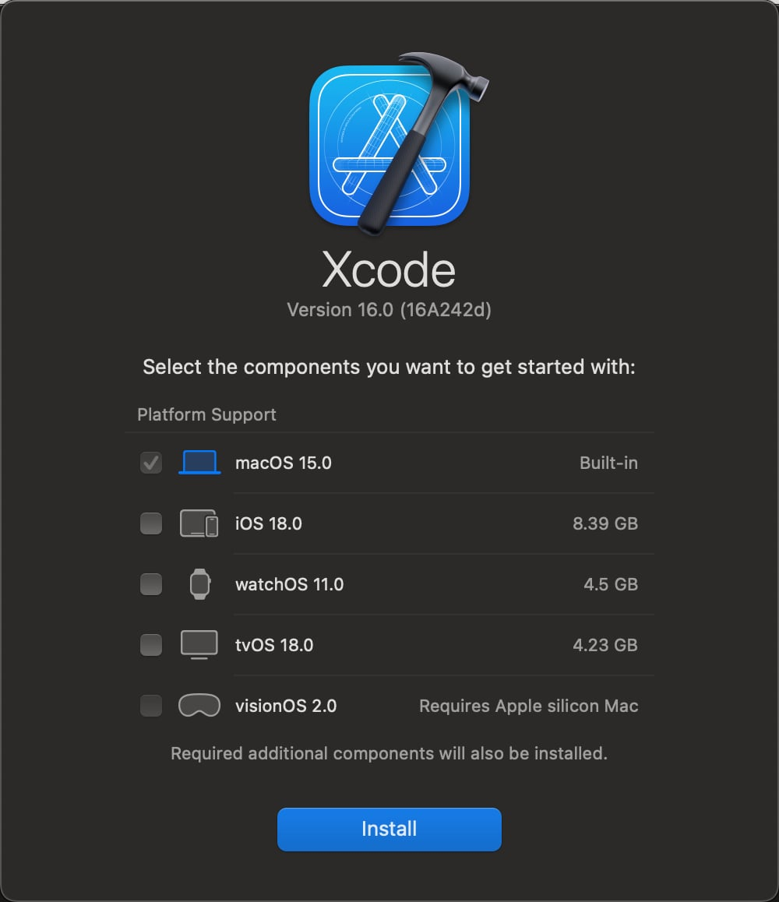
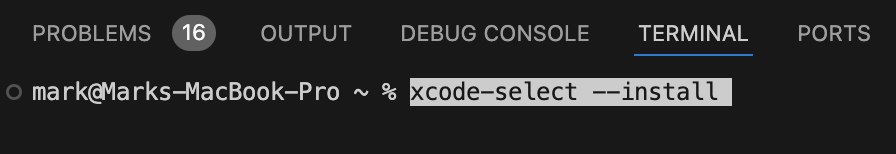
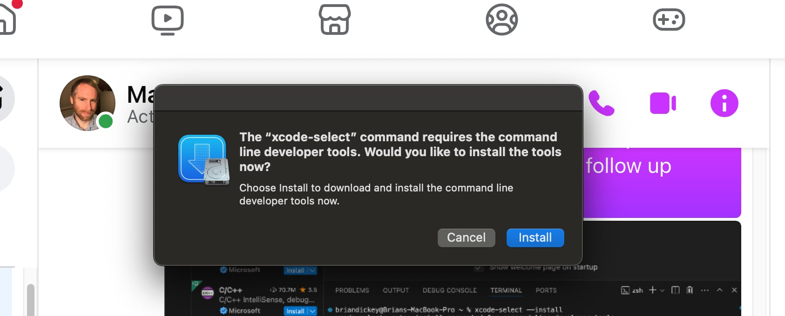

# Mac Setup Instructions

This guide will help you set up a development environment on a Mac.

## Table of Contents

- [Mac Setup Instructions](#mac-setup-instructions)
  - [Table of Contents](#table-of-contents)
  - [1. Download Xcode](#1-download-xcode)
  - [2. Install Xcode Command Line Tools](#2-install-xcode-command-line-tools)
  - [3. Install Node.js and npm](#3-install-nodejs-and-npm)
  - [Next Steps](#next-steps)

## 1. Download Xcode

From the **App Store**, search for and download "Xcode". You'll need to be signed in to an iCloud account to download Xcode.

When you encounter the following screen, click "Install" (i.e., you're accepting the default components):



After the Xcode application opens, close the Xcode application.

If you are having an issue installing Xcode, post a question to the **SUPPORT - SOFTWARE** > [# xcode-tools](https://discord.com/channels/1278288408795549716/1278301960247971982) channel.

## 2. Install Xcode Command Line Tools

1. **Open Visual Studio Code**

   - Open the **Visual Studio Code** application you downloaded previously. Download it from Google if you have not done so.

     - Open **Finder**.
     - Navigate to the **Applications** folder.
     - Locate **Visual Studio Code** and double-click to open it.

   - From the Mac **Menu Bar** at the top of the screen, open a new terminal window in VS Code by clicking **Terminal** > **New Terminal**

2. **Install Xcode Command Line Tools:**

   - In the terminal you just opened, enter the following command:

     ```shell
     xcode-select --install
     ```

     For example (your terminal will look slightly different):

     

   - Hit ENTER to run the command.
   - The following popup window should display:

     

     Click **Install**. If it asks any questions, click Okay.

     If you do not see it, try minimizing all of your applications.

   - Back in Visual Studio Code, follow the prompts to complete the installation.

3. **Verify Installation:**

   - In your open terminal, type the following commands and hit ENTER:

     ```shell
     xcode-select --version
     xcodebuild -version
     gcc --version
     ```

   - If Xcode Command Line Tools are properly installed, you should see output _similar_ to the following:

     ```shell
       xcode-select version 2397.
       Xcode 14.3.1
       Build version 14E300c
       Configured with: --prefix=/Applications/Xcode.app/Contents/Developer/usr
     ```

   If you don't see output like this or encounter an error, post a question to the **SUPPORT - MAC** > [# xcode](https://discord.com/channels/1278288408795549716/1278301960247971982) channel.

## 3. Install Node.js and npm

1. **Download Node.js Installer:**

   - Visit the [Node.js website](https://nodejs.org/) and download the Node.js (LTS) installer.

2. **Run the Installer:**

   - Open the downloaded file to start the installation process.

3. **Follow the Installation Wizard:**

   - Click "Next" to proceed with the default options.
   - Choose the default installation location or select a different one if needed.
   - Ensure that the option to install npm (Node Package Manager) is selected.
   - Click “Install” and then “Finish” once the installation is complete.

4. Restart your computer.

5. **Verify Installation:**

   - Open a new terminal:
     - From the Mac **Menu Bar** at the top of the screen, open a new terminal window in VS Code by clicking **Terminal** > **New Terminal**
   - Check Node.js version:

     ```bash
     node --version
     ```

   - Check npm version:

     ```bash
     npm --version
     ```

   - Both commands should output their respective versions, confirming that Node.js and npm are properly installed.

## Next Steps

Aftering completing the steps in this document, go to the [README - Cloning the Repository](https://github.com/mawentowski/api-documentation-course?tab=readme-ov-file#cloning-the-repository) section.
