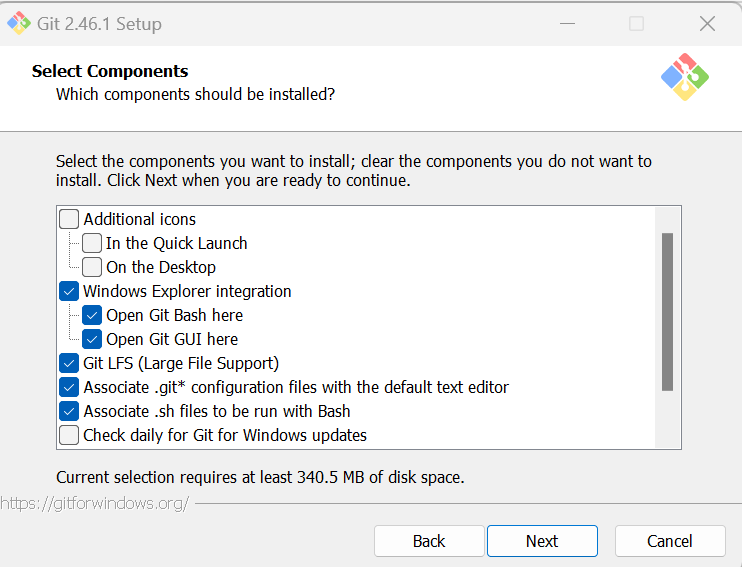
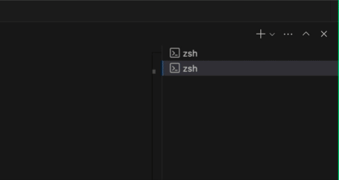
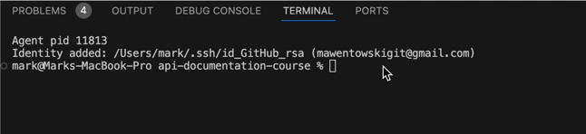

# Windows Setup Instructions

This guide walks you through setting a development environment on Windows.

## Table of Contents

- [Windows Setup Instructions](#windows-setup-instructions)
  - [Table of Contents](#table-of-contents)
  - [1. Install Git and Git Bash](#1-install-git-and-git-bash)
  - [2. Confirm Git and GitBash Installation](#2-confirm-git-and-gitbash-installation)
  - [3. Install Node.js and npm](#3-install-nodejs-and-npm)
  - [4. Add Node.js to Your PATH](#4-add-nodejs-to-your-path)
  - [9. Verify Node.js Intallation](#9-verify-nodejs-intallation)
  - [5. Install `curl`](#5-install-curl)
  - [6. Test `curl` Installation](#6-test-curl-installation)
  - [Next Steps](#next-steps)

## 1. Install Git and Git Bash

1. **Download Git for Windows:**

   - Visit the [Git for Windows website](https://gitforwindows.org/) and download the installer.

2. **Run the Installer:**

   - Open the downloaded file to start the installation process.

3. **Follow the Installation Wizard:**

   Read the following before continuing:

   - For the most part, accept all default options suggested.
   - For the **Select Components** screen, ensure the following components are selected:

     

   - Click "Install" and then “Finish” once the installation is complete.

4. **Complete the Installation:**

   - Click “Install” and then “Finish” once the installation is complete.

## 2. Confirm Git and GitBash Installation

1. Open **Visual Studio Code**:

   - Click on the **Start** button or press the Windows key on your keyboard.
   - Type "Visual Studio Code" or "VS Code."
   - Click on the **Visual Studio Code** application from the search results.

2. **Verify Git installation**:

   - Go to the top menu and click on **Terminal**.
   - Select **New Terminal** from the dropdown.
   - The next bullet applies to the video you see below.
   - On the bottom right-side, click the downward arrow next to the `+` icon and select `Git Bash`. See the video below (instead of `bash`, it will say `Git Bash`!):

   

   - A Git Bash terminal opens.
   - To confirm Git installation, run:

   ```shell
   git --version
   ```

   Refer to the following video (watch the video until it repeats):

   

   If the command returns a Git version, the installation was successful. If not, there may have been an issue during installation. For help, visit the **SUPPORT - WINDOWS** > [# git-gitbash](https://discord.com/channels/1278288408795549716/1278295713742061579) channel.

3. **Verify GitBash installation**:

   - To confirm that you are using Git Bash, run the following command in the terminal:

     ```shell
     echo $SHELL
     ```

   - The output should show a path similar to `/usr/bin/bash` if Git Bash is set up correctly. If not, there may have been an issue configuring Git Bash as the default terminal in VS Code. For help, visit the **SUPPORT - WINDOWS** > [# git-gitbash](https://discord.com/channels/1278288408795549716/1278295713742061579) channel.

## 3. Install Node.js and npm

1. **Download Node.js Installer:**

   - Visit the [Node.js website](https://nodejs.org/) and download the Windows Installer (LTS or Current version).

2. **Run the Installer:**

   - Open the downloaded file to start the installation process.

3. **Follow the Installation Wizard:**

   Read the following before continuing:

   - For the most part, accept all default options suggested.
   - Make a note of the default installation location (e.g., `C:\Program Files\nodejs)`). This will be used in a future step.
   - Ensure that the option to install npm (Node Package Manager) is selected.
   - _If you encounter_ a "Tools for Native Modules" screen, simply click "Next" without ticking the checkbox.
   - Click “Install” and then “Finish” once the installation is complete.

## 4. Add Node.js to Your PATH

Now, you'll need to add the Node.js path to the system PATH environment variable.

Here's how to do that:

1. **Open Environment Variables**:

- Press `Windows + R`, type `sysdm.cpl`, and hit **Enter**.
- Go to the **Advanced** tab and click on **Environment Variables**.

2. **Edit the PATH Variable**:

- In the **System Variables** section, scroll down and find the **Path variable**.
- Select **Path** and click **Edit**.

3. **Add the Node.js Path**:

- In the **Edit Environment Variable** dialog, click **New** and paste the path to your Node.js installation (e.g., C:\Program Files\nodejs).
- Click **OK** to save.

4. Restart your computer.

## 9. Verify Node.js Intallation

1. **Open a new terminal in VS Code**:

   - Open Visual Studio Code (if it is not already open).
   - Select `Terminal` > `New Terminal` from the menu.
   - On the right-side, click the downward arrow next to the `+` icon and select `Git Bash`. See the video below (instead of `bash`, it will say `Git Bash`!):

     

   - A Git Bash terminal opens.

2. **Check Node.js version**:

   ```shell
   node --version
   ```

   3. Check npm version:

   ```shell
   npm --version
   ```

3. Both commands should output their respective versions, confirming that Node.js and npm are properly installed.

If those commands did not work, there is liklely an issue with your Node.js installation. You can post to the **SUPPORT - WINDOWS** > [# npm-node](https://discord.com/channels/1278288408795549716/1278296962340487209) channel for help.

## 5. Install `curl`

1. **Download `curl`:**

   - Visit the [curl website](https://curl.se/windows/) and download the appropriate `curl` package for Windows.

2. **Extract and Install `curl`:**

   Download curl: Go to the curl website and download the appropriate curl package for Windows

   Extract and Install curl: Extract the downloaded ZIP file to a location of your choice.

   - Add the path of the extracted `curl` executable (e.g., `C:\path\to\curl\bin`) to your system's `PATH` environment variable.
   - Open the Start menu, search for "Environment Variables," and select "Edit the system environment variables."
   - Click the "Environment Variables" button.
   - In the "System variables" section, find the `Path` variable and click "Edit."
   - Click "New" and add the path to the `curl` executable.
   - Click "OK" to close all dialogs.

## 6. Test `curl` Installation

1. **Open a new terminal in VS Code**:

   - Open Visual Studio Code.
   - Select `Terminal` > `New Terminal` from the menu.
   - On the right-side, click the downward arrow next to the `+` icon and select `Git Bash`. See the video below (instead of `bash`, it will say `Git Bash`!):

     

   - A Git Bash terminal opens.
   - Run this simple `curl` command to verify it’s working:

     ```shell
     curl https://jsonplaceholder.typicode.com/posts/1
     ```

   - This command should return data from a free API endpoint, confirming that `curl` is installed and functioning correctly.

     If the command did not return data, there is liklely an issue with your curl installation. You can post to the **SUPPORT - WINDOWS** > [# curl](https://discord.com/channels/1278288408795549716/1278295767861297195) channel for help.

## Next Steps

Aftering completing the steps in this document, go to the [README - Cloning the Repository](https://github.com/mawentowski/api-documentation-course?tab=readme-ov-file#cloning-the-repository) section.
