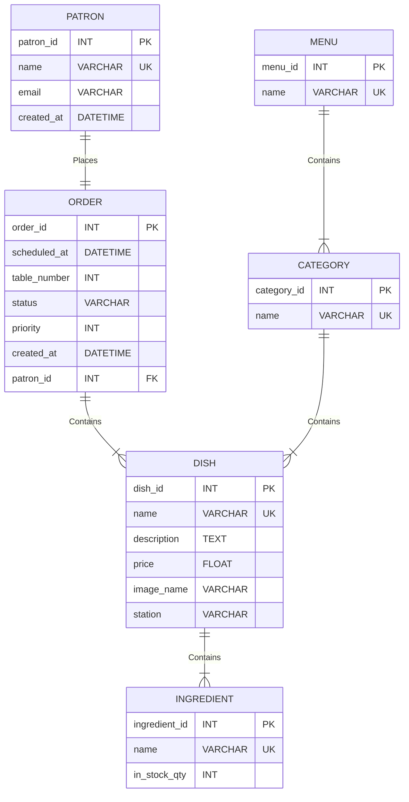

# Entity relationship diagram

```mermaid
erDiagram
    PATRON {
        patron_id INT PK
        name VARCHAR UK
        email VARCHAR
        created_at DATETIME
    }

    ORDER {
        order_id INT PK
        scheduled_at DATETIME
        table_number INT
        status VARCHAR
        priority INT
        created_at DATETIME
        patron_id INT FK
    }

    DISH {
        dish_id INT PK
        name VARCHAR UK
        description TEXT
        price FLOAT
        image_name VARCHAR
        station VARCHAR
    }

    INGREDIENT {
        ingredient_id INT PK
        name VARCHAR UK
        in_stock_qty INT
    }

    MENU {
        menu_id INT PK
        name VARCHAR UK
    }

    CATEGORY {
        category_id INT PK
        name VARCHAR UK
    }

    PATRON ||--|| ORDER : Places
    ORDER ||--|{ DISH : Contains
    DISH ||--|{ INGREDIENT : Contains
    MENU ||--|{ CATEGORY : Contains
    CATEGORY ||--|{ DISH : Contains

```

## Resources

- [Mermaid entity relatonship diagrams](https://mermaid.js.org/syntax/entityRelationshipDiagram.html)
