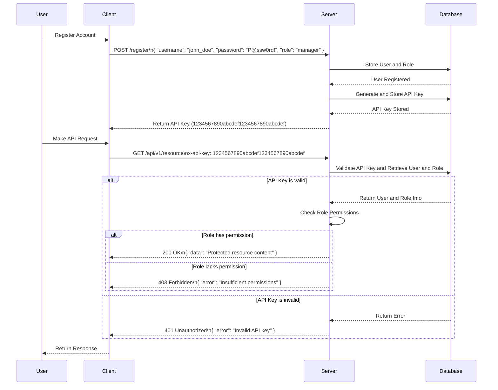
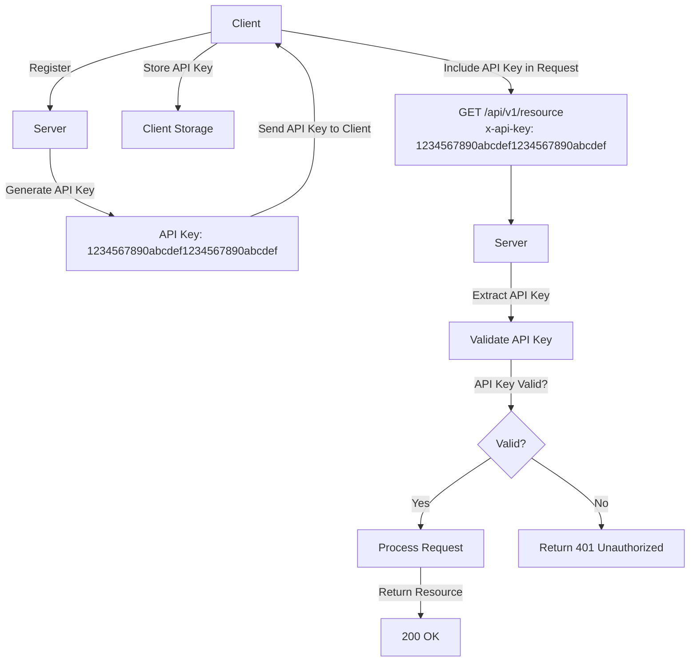
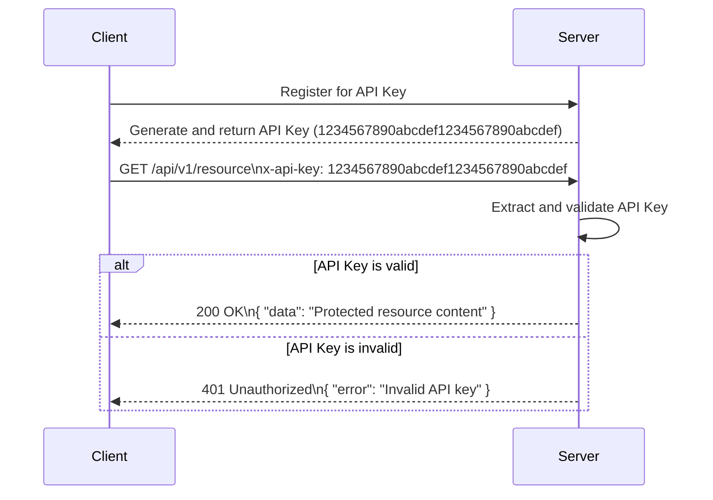
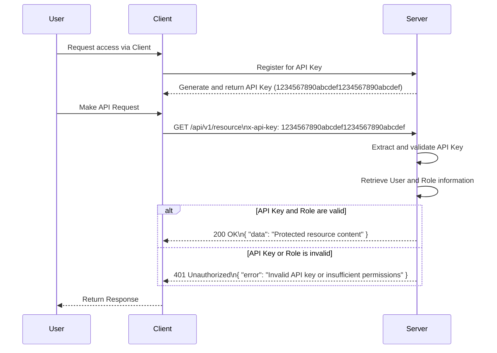

```mermaid
sequenceDiagram
    participant User
    participant Client
    participant Server
    participant DB as Database

    User->>Client: Register Account
    Client->>Server: POST /register\n{ "username": "john_doe", "password": "P@ssw0rd!", "role": "manager" }
    Server->>DB: Store User and Role
    DB-->>Server: User Registered
    Server->>DB: Generate and Store API Key
    DB-->>Server: API Key Stored
    Server-->>Client: Return API Key (1234567890abcdef1234567890abcdef)

    User->>Client: Make API Request
    Client->>Server: GET /api/v1/resource\nx-api-key: 1234567890abcdef1234567890abcdef
    Server->>DB: Validate API Key and Retrieve User and Role
    alt API Key is valid
        DB-->>Server: Return User and Role Info
        Server->>Server: Check Role Permissions
        alt Role has permission
            Server-->>Client: 200 OK\n{ "data": "Protected resource content" }
        else Role lacks permission
            Server-->>Client: 403 Forbidden\n{ "error": "Insufficient permissions" }
        end
    else API Key is invalid
        DB-->>Server: Return Error
        Server-->>Client: 401 Unauthorized\n{ "error": "Invalid API key" }
    end
    Client-->>User: Return Response

```

```mermaid
graph TD
    A[Client] -->|Register| B[Server]
    B -->|Generate API Key| C[API Key: 1234567890abcdef1234567890abcdef]
    C -->|Send API Key to Client| A
    A -->|Store API Key| D[Client Storage]

    A -->|Include API Key in Request| E[GET /api/v1/resource\nx-api-key: 1234567890abcdef1234567890abcdef]
    E --> F[Server]
    F -->|Extract API Key| G[Validate API Key]
    
    G -->|API Key Valid?| H{Valid?}
    H -->|Yes| I[Process Request]
    H -->|No| J[Return 401 Unauthorized]

    I -->|Return Resource| K[200 OK]
```

```mermaid
sequenceDiagram
    participant Client
    participant Server


    Client->>Server: Register for API Key
    Server-->>Client: Generate and return API Key (1234567890abcdef1234567890abcdef)
   

    Client->>Server: GET /api/v1/resource\nx-api-key: 1234567890abcdef1234567890abcdef
    Server->>Server: Extract and validate API Key

    alt API Key is valid
        Server-->>Client: 200 OK\n{ "data": "Protected resource content" }
    else API Key is invalid
        Server-->>Client: 401 Unauthorized\n{ "error": "Invalid API key" }
    end

```

```mermaid
sequenceDiagram
    participant User
    participant Client
    participant Server


    User->>Client: Request access via Client
    Client->>Server: Register for API Key
    Server-->>Client: Generate and return API Key (1234567890abcdef1234567890abcdef)


    User->>Client: Make API Request
    Client->>Server: GET /api/v1/resource\nx-api-key: 1234567890abcdef1234567890abcdef
    Server->>Server: Extract and validate API Key
    Server->>Server: Retrieve User and Role information

    alt API Key and Role are valid
        Server-->>Client: 200 OK\n{ "data": "Protected resource content" }
    else API Key or Role is invalid
        Server-->>Client: 401 Unauthorized\n{ "error": "Invalid API key or insufficient permissions" }
    end
    Client-->>User: Return Response

```