## Domain modeling:

### Concepts

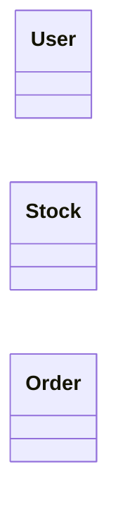

## Attributes

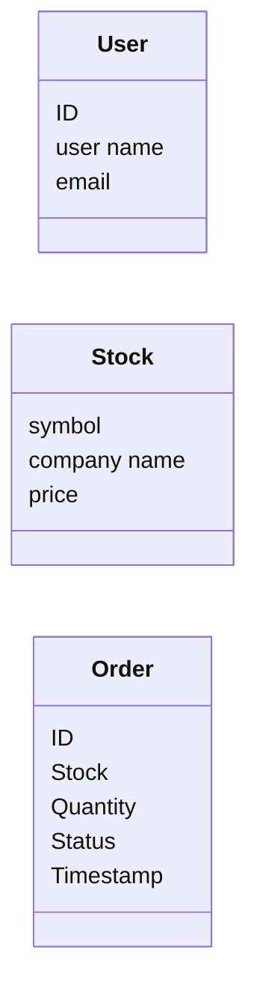

## Actions

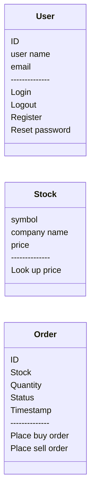

## Relationships

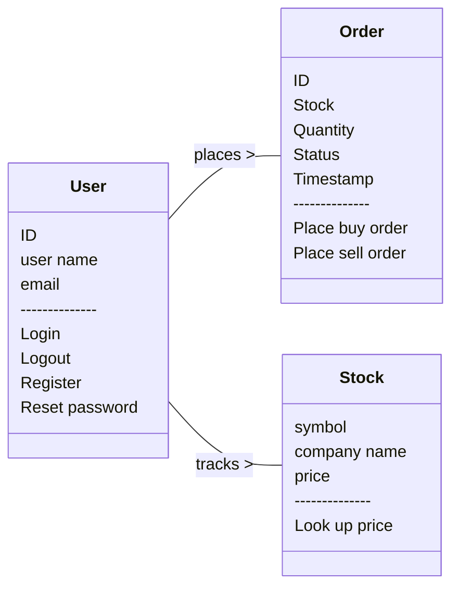

## Full

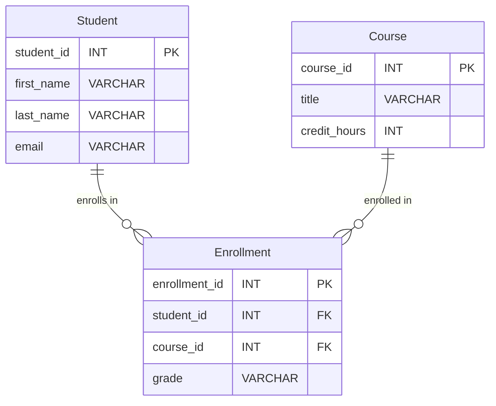

## Entities

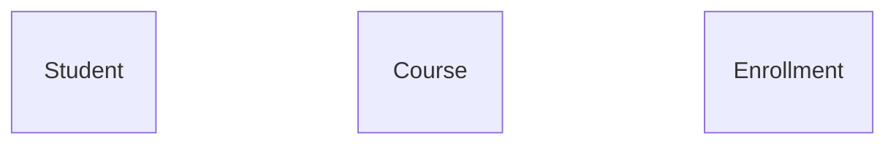

## Attributes

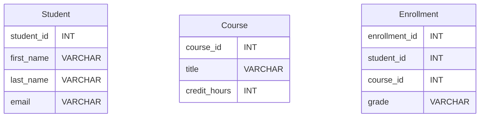

Relationships

## Cardinality

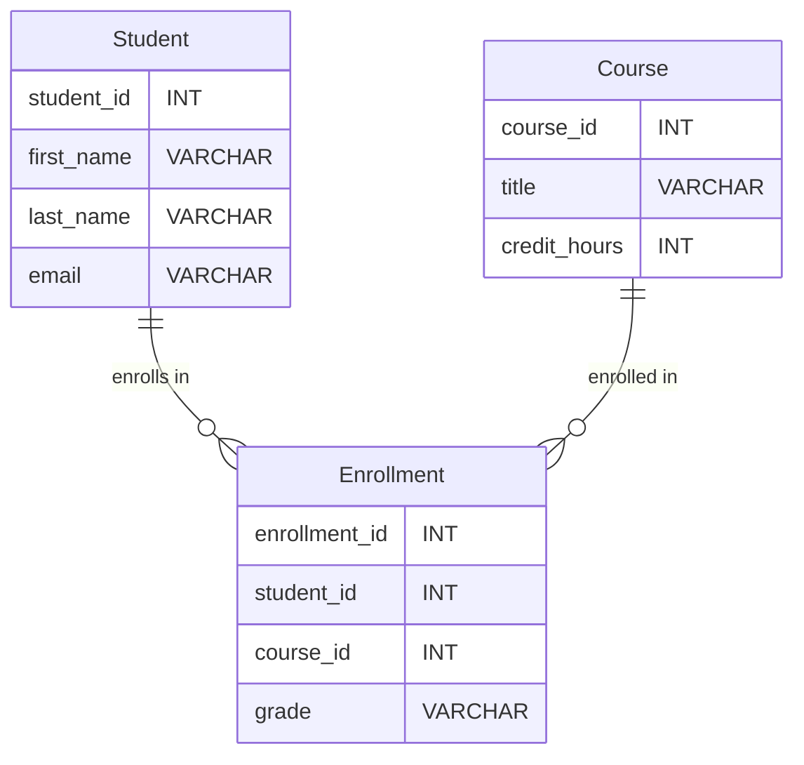

## Foreign key

## one to one

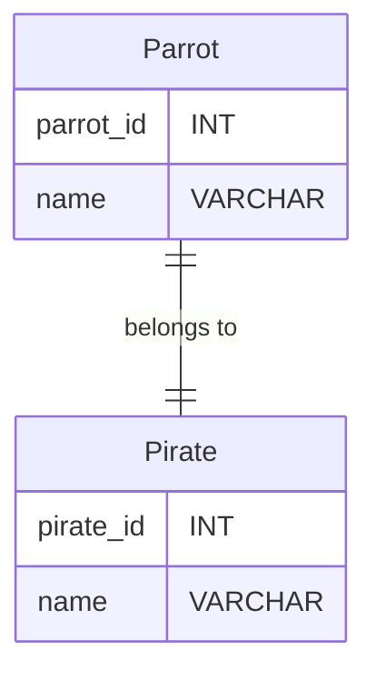

many to one

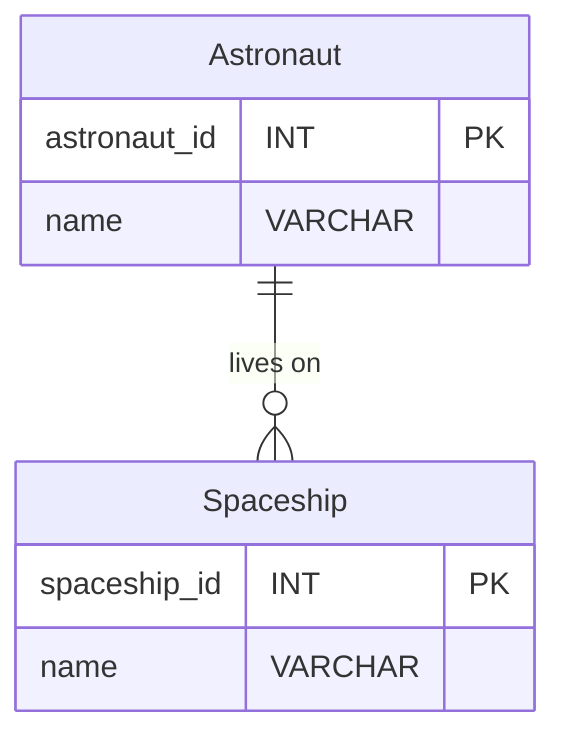

one to many

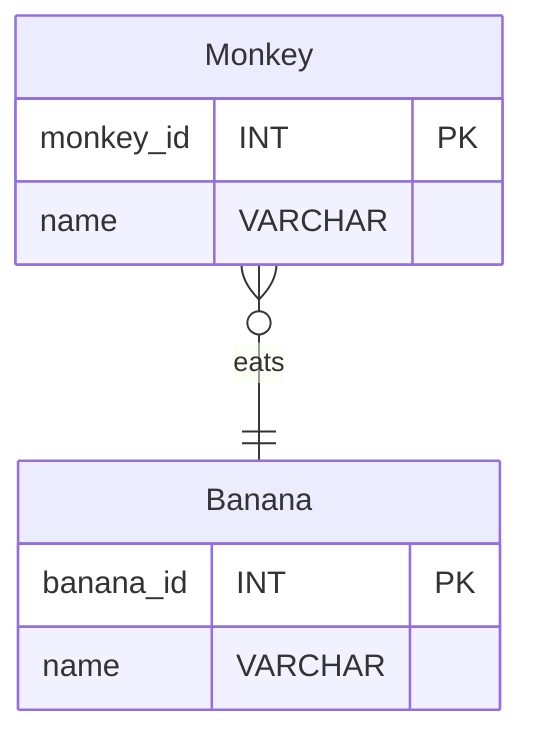

many to many

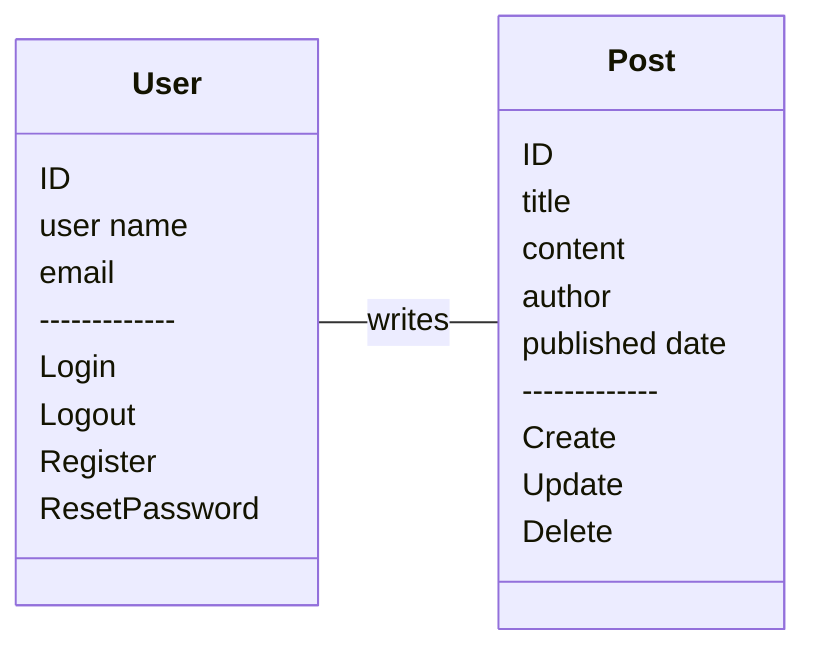

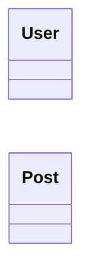